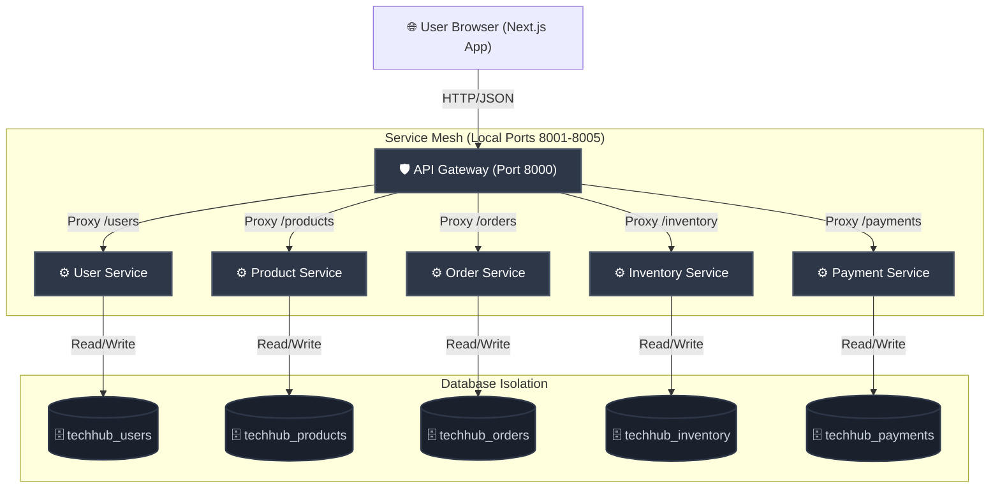

# TechHub Architecture Overview

This document provides a conceptual outline of the Phase 1 microservice architecture.

## System Topology

---

## Architectural Principles

1. **Database-Per-Service**: Each microservice manages its own separate schema and data store. Direct cross-database joins are forbidden; communication occurs exclusively via HTTP APIs.
2. **Reverse Proxy API Gateway**: The frontend does not communicate directly with the individual microservices. All requests are funneled through the FastAPI `api-gateway` which acts as an asynchronous reverse proxy, reducing CORS issues and consolidating documentation access.
3. **Decoupled Deployment**: Each service operates in a containerized sandbox with its own multi-stage `Dockerfile`. 
4. **Environment Isolation**: Service configuration variables are separated from the codebase using system environment variables, mapped locally via `.env` files and in Kubernetes via ConfigMaps and Secrets.
