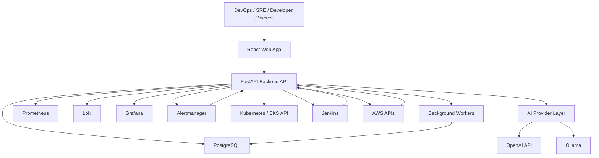
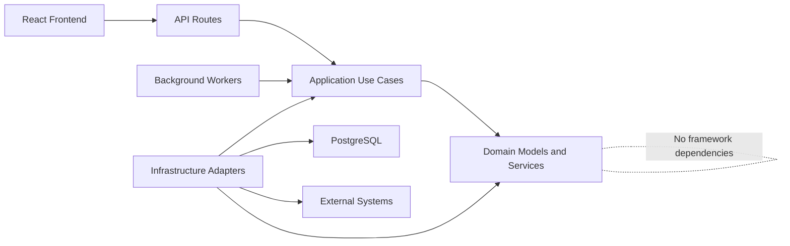
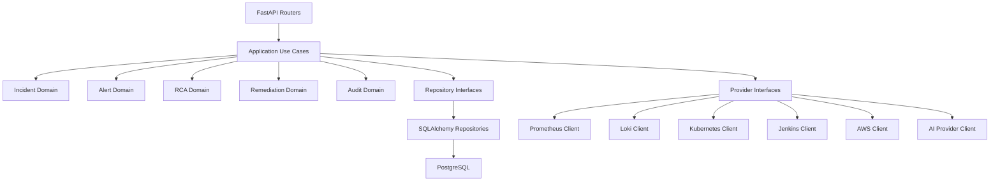
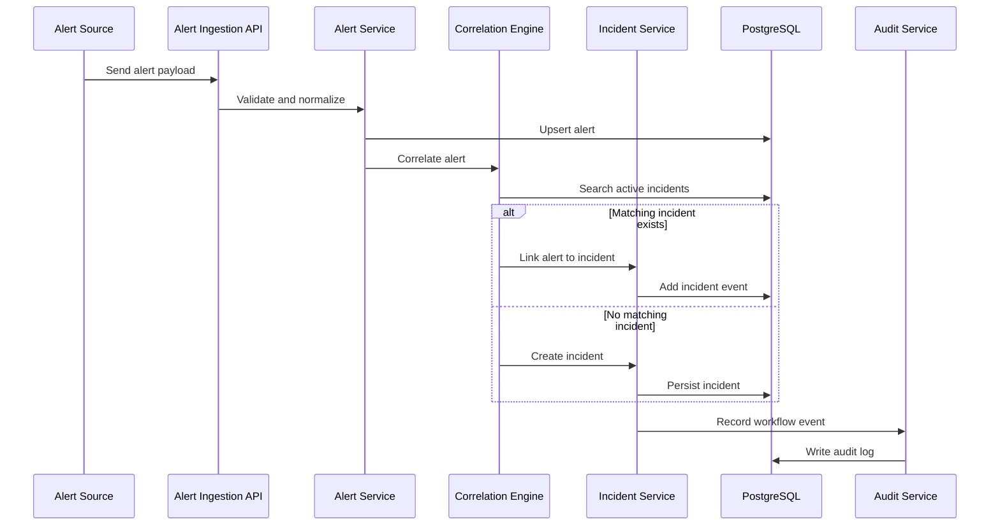
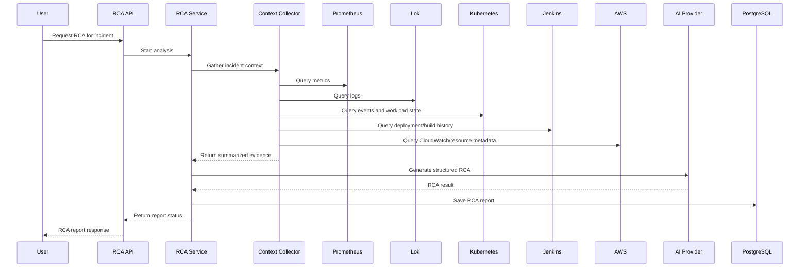
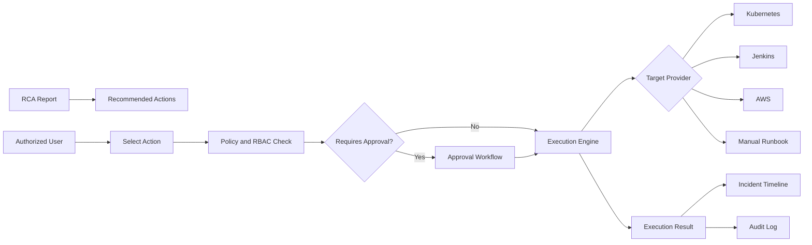
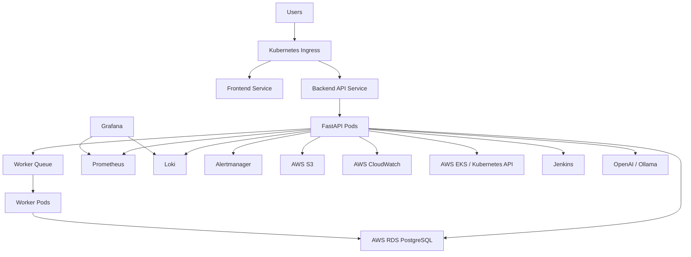
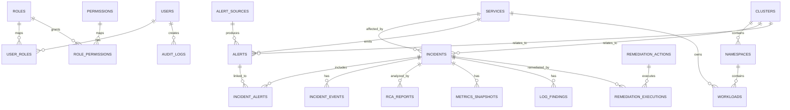
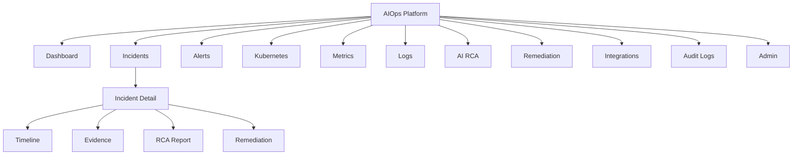

# Architecture Diagrams

## System Context

## Clean Architecture Dependency Flow

## Backend Component View

## Alert to Incident Workflow

## AI RCA Workflow

## Remediation Workflow

## Deployment Architecture

## Database Relationship Diagram

## Frontend Information Architecture

