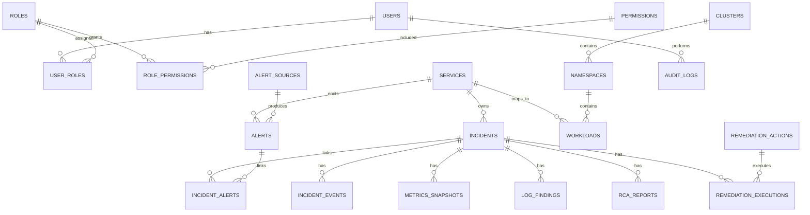

# Database Design

## Overview

PostgreSQL stores transactional and operational metadata for the platform. Prometheus remains the system of record for raw metrics, and Loki remains the system of record for raw logs. PostgreSQL stores incidents, alerts, users, roles, RCA reports, remediation state, integration metadata, and audit events.

## Design Principles

- Use UUID primary keys for externally exposed entities.
- Use UTC timestamps for all time fields.
- Use normalized relational tables for core workflows.
- Use JSONB only for provider-specific metadata, labels, annotations, and structured evidence.
- Store summaries and references for metrics and logs, not high-volume raw telemetry.
- Keep audit logs immutable.
- Store secrets through encrypted storage or external secret references.
- Use Alembic for every schema migration.

## Core Tables

### users

Stores platform users.

| Column | Type | Notes |
|---|---|---|
| id | uuid | Primary key |
| email | varchar | Unique, indexed |
| full_name | varchar | Display name |
| hashed_password | varchar | Strong password hash |
| status | varchar | active, disabled, pending |
| last_login_at | timestamptz | Nullable |
| created_at | timestamptz | Required |
| updated_at | timestamptz | Required |

### roles

Stores built-in and custom roles.

| Column | Type | Notes |
|---|---|---|
| id | uuid | Primary key |
| name | varchar | Admin, SRE, Developer, Viewer |
| description | text | Nullable |
| is_system | boolean | True for built-in roles |
| created_at | timestamptz | Required |

### permissions

Stores granular access permissions.

| Column | Type | Notes |
|---|---|---|
| id | uuid | Primary key |
| key | varchar | Example: incidents:update |
| description | text | Nullable |
| created_at | timestamptz | Required |

### user_roles

Maps users to roles.

| Column | Type | Notes |
|---|---|---|
| user_id | uuid | FK users.id |
| role_id | uuid | FK roles.id |
| assigned_by | uuid | FK users.id, nullable |
| assigned_at | timestamptz | Required |

Primary key: `(user_id, role_id)`.

### role_permissions

Maps roles to permissions.

| Column | Type | Notes |
|---|---|---|
| role_id | uuid | FK roles.id |
| permission_id | uuid | FK permissions.id |

Primary key: `(role_id, permission_id)`.

### services

Represents monitored applications or infrastructure services.

| Column | Type | Notes |
|---|---|---|
| id | uuid | Primary key |
| name | varchar | Indexed |
| slug | varchar | Unique |
| description | text | Nullable |
| owner_team | varchar | Nullable |
| tier | varchar | critical, high, standard, low |
| repository_url | varchar | Nullable |
| runbook_url | varchar | Nullable |
| created_at | timestamptz | Required |
| updated_at | timestamptz | Required |

### clusters

Represents Kubernetes or EKS clusters.

| Column | Type | Notes |
|---|---|---|
| id | uuid | Primary key |
| name | varchar | Indexed |
| provider | varchar | eks, self-managed, other |
| region | varchar | Nullable |
| environment | varchar | dev, staging, prod |
| status | varchar | active, degraded, unavailable |
| metadata | jsonb | Provider-specific metadata |
| created_at | timestamptz | Required |
| updated_at | timestamptz | Required |

### namespaces

Represents Kubernetes namespaces.

| Column | Type | Notes |
|---|---|---|
| id | uuid | Primary key |
| cluster_id | uuid | FK clusters.id |
| name | varchar | Required |
| labels | jsonb | Nullable |
| created_at | timestamptz | Required |

Unique index: `(cluster_id, name)`.

### workloads

Represents Kubernetes workloads.

| Column | Type | Notes |
|---|---|---|
| id | uuid | Primary key |
| cluster_id | uuid | FK clusters.id |
| namespace_id | uuid | FK namespaces.id |
| service_id | uuid | FK services.id, nullable |
| kind | varchar | deployment, statefulset, daemonset, job, cronjob |
| name | varchar | Required |
| status | varchar | healthy, degraded, failed, unknown |
| labels | jsonb | Nullable |
| metadata | jsonb | Nullable |
| created_at | timestamptz | Required |
| updated_at | timestamptz | Required |

Unique index: `(cluster_id, namespace_id, kind, name)`.

### alert_sources

Stores alert source configuration metadata.

| Column | Type | Notes |
|---|---|---|
| id | uuid | Primary key |
| name | varchar | Required |
| source_type | varchar | alertmanager, cloudwatch, jenkins, custom |
| status | varchar | active, disabled, error |
| config | jsonb | Non-secret config |
| secret_ref | varchar | External secret reference |
| created_at | timestamptz | Required |
| updated_at | timestamptz | Required |

### alerts

Stores normalized alerts.

| Column | Type | Notes |
|---|---|---|
| id | uuid | Primary key |
| source_id | uuid | FK alert_sources.id, nullable |
| external_id | varchar | Provider alert ID or fingerprint |
| title | varchar | Required |
| description | text | Nullable |
| severity | varchar | critical, warning, info |
| status | varchar | firing, resolved, acknowledged, suppressed |
| service_id | uuid | FK services.id, nullable |
| cluster_id | uuid | FK clusters.id, nullable |
| labels | jsonb | Default empty object |
| annotations | jsonb | Default empty object |
| starts_at | timestamptz | Required |
| ends_at | timestamptz | Nullable |
| created_at | timestamptz | Required |
| updated_at | timestamptz | Required |

Recommended indexes:

- `(status, severity)`
- `(service_id, starts_at)`
- `(cluster_id, starts_at)`
- `(source_id, external_id)` unique where `external_id` is not null

### incidents

Stores incidents.

| Column | Type | Notes |
|---|---|---|
| id | uuid | Primary key |
| incident_number | varchar | Human-readable unique ID |
| title | varchar | Required |
| description | text | Nullable |
| severity | varchar | sev1, sev2, sev3, sev4 |
| priority | varchar | p1, p2, p3, p4 |
| status | varchar | open, investigating, mitigated, resolved, closed |
| service_id | uuid | FK services.id, nullable |
| cluster_id | uuid | FK clusters.id, nullable |
| owner_id | uuid | FK users.id, nullable |
| created_by | uuid | FK users.id, nullable for automated incidents |
| detected_at | timestamptz | Required |
| acknowledged_at | timestamptz | Nullable |
| mitigated_at | timestamptz | Nullable |
| resolved_at | timestamptz | Nullable |
| closed_at | timestamptz | Nullable |
| created_at | timestamptz | Required |
| updated_at | timestamptz | Required |

Recommended indexes:

- `(status, severity)`
- `(service_id, detected_at)`
- `(owner_id, status)`

### incident_alerts

Maps alerts to incidents.

| Column | Type | Notes |
|---|---|---|
| incident_id | uuid | FK incidents.id |
| alert_id | uuid | FK alerts.id |
| linked_at | timestamptz | Required |

Primary key: `(incident_id, alert_id)`.

### incident_events

Stores incident timeline events.

| Column | Type | Notes |
|---|---|---|
| id | uuid | Primary key |
| incident_id | uuid | FK incidents.id |
| event_type | varchar | created, updated, assigned, comment, rca_started, rca_completed, remediation_started, remediation_completed |
| actor_id | uuid | FK users.id, nullable |
| message | text | Required |
| data | jsonb | Nullable |
| created_at | timestamptz | Required |

Recommended index: `(incident_id, created_at)`.

### metrics_snapshots

Stores incident-related metric summaries.

| Column | Type | Notes |
|---|---|---|
| id | uuid | Primary key |
| incident_id | uuid | FK incidents.id |
| source | varchar | prometheus, cloudwatch |
| query | text | Required |
| time_range_start | timestamptz | Required |
| time_range_end | timestamptz | Required |
| summary | text | Nullable |
| data | jsonb | Aggregated values or references |
| created_at | timestamptz | Required |

### log_findings

Stores incident-related log analysis findings.

| Column | Type | Notes |
|---|---|---|
| id | uuid | Primary key |
| incident_id | uuid | FK incidents.id |
| source | varchar | loki, cloudwatch |
| query | text | Required |
| time_range_start | timestamptz | Required |
| time_range_end | timestamptz | Required |
| severity | varchar | critical, warning, info |
| summary | text | Required |
| examples | jsonb | Redacted log examples |
| created_at | timestamptz | Required |

### rca_reports

Stores AI-generated or human-authored RCA reports.

| Column | Type | Notes |
|---|---|---|
| id | uuid | Primary key |
| incident_id | uuid | FK incidents.id |
| provider | varchar | openai, ollama, manual |
| model | varchar | Nullable |
| status | varchar | pending, completed, failed |
| summary | text | Nullable |
| likely_root_cause | text | Nullable |
| evidence | jsonb | Structured evidence |
| recommendations | jsonb | Structured recommendations |
| confidence_score | numeric | 0 to 1 |
| prompt_version | varchar | Nullable |
| token_usage | jsonb | Nullable |
| created_by | uuid | FK users.id, nullable |
| created_at | timestamptz | Required |
| updated_at | timestamptz | Required |

### remediation_actions

Stores reusable remediation catalog items.

| Column | Type | Notes |
|---|---|---|
| id | uuid | Primary key |
| name | varchar | Required |
| description | text | Required |
| action_type | varchar | kubernetes, jenkins, aws, script, manual |
| risk_level | varchar | low, medium, high, critical |
| requires_approval | boolean | Required |
| allowed_roles | jsonb | Role keys |
| parameters_schema | jsonb | JSON schema for inputs |
| implementation_ref | varchar | Executor/action reference |
| enabled | boolean | Required |
| created_at | timestamptz | Required |
| updated_at | timestamptz | Required |

### remediation_executions

Stores remediation execution history.

| Column | Type | Notes |
|---|---|---|
| id | uuid | Primary key |
| incident_id | uuid | FK incidents.id, nullable |
| action_id | uuid | FK remediation_actions.id |
| requested_by | uuid | FK users.id |
| approved_by | uuid | FK users.id, nullable |
| status | varchar | pending_approval, approved, running, succeeded, failed, cancelled |
| parameters | jsonb | Redacted execution parameters |
| result | jsonb | Execution result |
| started_at | timestamptz | Nullable |
| completed_at | timestamptz | Nullable |
| created_at | timestamptz | Required |
| updated_at | timestamptz | Required |

### integrations

Stores external integration configuration metadata.

| Column | Type | Notes |
|---|---|---|
| id | uuid | Primary key |
| name | varchar | Required |
| integration_type | varchar | prometheus, loki, grafana, alertmanager, kubernetes, jenkins, aws, openai, ollama |
| status | varchar | active, disabled, error |
| config | jsonb | Non-secret settings |
| secret_ref | varchar | External secret reference |
| last_health_check_at | timestamptz | Nullable |
| last_health_status | varchar | Nullable |
| created_at | timestamptz | Required |
| updated_at | timestamptz | Required |

### audit_logs

Stores immutable audit events.

| Column | Type | Notes |
|---|---|---|
| id | uuid | Primary key |
| actor_id | uuid | FK users.id, nullable |
| actor_type | varchar | user, system, integration |
| action | varchar | Required |
| resource_type | varchar | Required |
| resource_id | uuid | Nullable |
| ip_address | inet | Nullable |
| user_agent | text | Nullable |
| outcome | varchar | success, failure |
| metadata | jsonb | Redacted structured details |
| created_at | timestamptz | Required |

Recommended indexes:

- `(resource_type, resource_id, created_at)`
- `(actor_id, created_at)`
- `(action, created_at)`

### notifications

Stores notification delivery state.

| Column | Type | Notes |
|---|---|---|
| id | uuid | Primary key |
| incident_id | uuid | FK incidents.id, nullable |
| channel | varchar | email, slack, webhook, pager |
| recipient | varchar | Required |
| status | varchar | pending, sent, failed |
| payload | jsonb | Redacted payload |
| error_message | text | Nullable |
| sent_at | timestamptz | Nullable |
| created_at | timestamptz | Required |

## Entity Relationships

## Retention Strategy

Suggested defaults:

- Incidents: indefinite or according to compliance policy.
- RCA reports: indefinite or at least 2 years.
- Audit logs: 1 to 7 years depending on compliance needs.
- Alerts: 90 to 365 days in PostgreSQL, longer in archive storage.
- Metric snapshots: 90 to 180 days.
- Log findings: 180 to 365 days.
- Raw logs and metrics: controlled by Loki and Prometheus retention.

## Migration Strategy

- Use Alembic for all schema migrations.
- Every schema change must include a migration.
- Seed data should include default roles and permissions.
- Destructive migrations require explicit rollout planning.
- Production migrations should be backward-compatible where possible.
