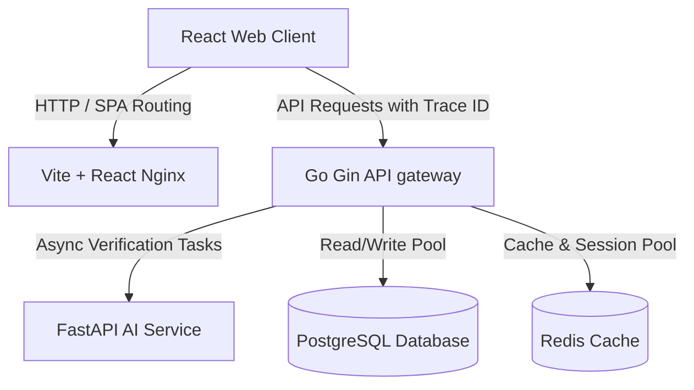

# System Architecture & Design Design

Zidoc uses a Modular Monolith backend design and a Clean Architecture structure to ensure isolation of modules, extensibility, and separation of concerns.

---

## High-Level System Topology



---

## Clean Architecture Layers (Backend)

The Go backend located in `apps/api` implements a decoupled layered architecture:

```
  ┌─────────────────────────────────────────────────────────┐
  │                        Handlers                         │  (HTTP Gin Controllers, Swagger)
  └────────────────────────────┬────────────────────────────┘
                               │ (Dependency Injected)
  ┌────────────────────────────▼────────────────────────────┐
  │                        Usecases                         │  (Core Business Logic Interfaces)
  └────────────────────────────┬────────────────────────────┘
                               │ (Dependency Injected)
  ┌────────────────────────────▼────────────────────────────┐
  │                      Repositories                       │  (GORM Database Operations)
  └─────────────────────────────────────────────────────────┘
```

1. **Handlers (Delivery)**: Processes HTTP requests, extracts parameters, coordinates inputs, and returns standard JSON payloads. Handles API routing, Swagger generation, and middleware (CORS, logging, request ID injection).
2. **Usecases (Domain Logic)**: Contains the orchestration logic of business processes. Fully decoupled from Gin and GORM.
3. **Repositories (Gateway)**: Deals directly with database persistence and Redis caching using interface abstractions.

---

## Distributed Tracing & Telemetry

### Request ID Injection
- Every client-initiated request receives a unique `X-Request-ID` tracing header.
- The Go Gateway intercepts the request, maps the tracer into the Go context, and ensures that any corresponding database logs, downstream AI service payloads, and debug logs print the Request ID.

### Structured Logging
- Zap logger converts outputs to JSON logs during production-level runs.
- Console-friendly format with level-coloring is used locally to facilitate development.
